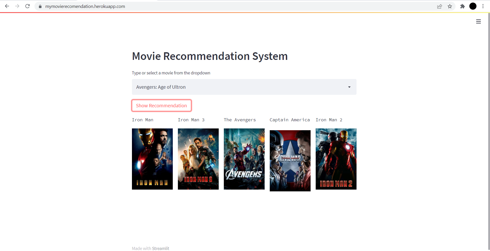

# Movie Recommendation sytem 
This Project is an implementation of content based recomendation system which is based on similarity between the tags. I have divided this project in four section which are listed below : <br>
- Preprocessing
- Model building
- Streamlit
- Deployment

## Preprocesssing
For this project i have used the Kaggle TMDB dataset which can be found [here](https://www.kaggle.com/tmdb/tmdb-movie-metadata) and did some preprocessing according to our objective. <br>
1. Initially we had two dataframe i.e. Movies and Credits and instead of working on two dataframes i merged them both on the basis of movie_id.
2. After merging we had 23 columns and since not every column is required to implement our objective. Since this is a content based recomendation system we need column which can help us in creating tags. So we extract 7 column i.e movie_id,	title,	overview,	genres,	keywords,	cast,	crew, which i think was sufficient to create our tags and build this recomendation system.
3. Then to create a tag column i concatenate these 'overview','genres','keywords','cast','crew' columns and droped the respective column because we dont need them now. So now we have only three column i.e. movie_id, title, tag.
4. Then we check for NaN, duplicate data and removed stop words and brought the tags column in to lower case.
5. Then we did Stemming so that only the original form is present in the tag columns.

## Model Building
Then after preprocessing we gets on to the model building and for that the approch was we'll find the similarity score betweeen the tags od two movies and the top five will get recommended to the user.
1. To get the similarity between the text we need to convert the text into Vector form since we oly have a textual data. And, to convert the textual data into vectorize form we have used the Bag of words technique.
2. And, after that we used cosine similarity to build our model which will find the similarity between one movie to every other movie.

## Streamlit
After building a model we need to build some kind of front end where it will recieve an user input and display the result and for that we used streamlit. Streamlit will help us in creating a beautiful web app very easily. In case if you want to see the documentation you can find it [here](https://docs.streamlit.io/).

## Deployment
Then the last part of this project was to deploy it. For deployment we choose heroku which gives a facility of free hosting service with some limitation. But before hosting into heroku we need to create some specific files i.e. Procfile, setup.sh, requirement.txt.
#### Procfile
```
web: sh setup.sh && streamlit run main.py
```
#### setup.sh
```
mkdir -p ~/.streamlit/

echo "\
[server]\n\
port = $PORT\n\
enableCORS = false\n\
headless = true\n\
\n\
" > ~/.streamlit/config.toml
```
#### .gitignore
```
venv
```
And, Then we need to sign up/Login on to heroku and create an app, and after creating an app you need to install Heroku.exe (For windows) and run a list of command you need to run in your terminal that will be listed into your app dashboard.

### HOST
After doint all the above process you will get a website where your app will run. You can find my webapp @[https://mymovierecomendation.herokuapp.com/](https://mymovierecomendation.herokuapp.com/) which will look like something like this.



